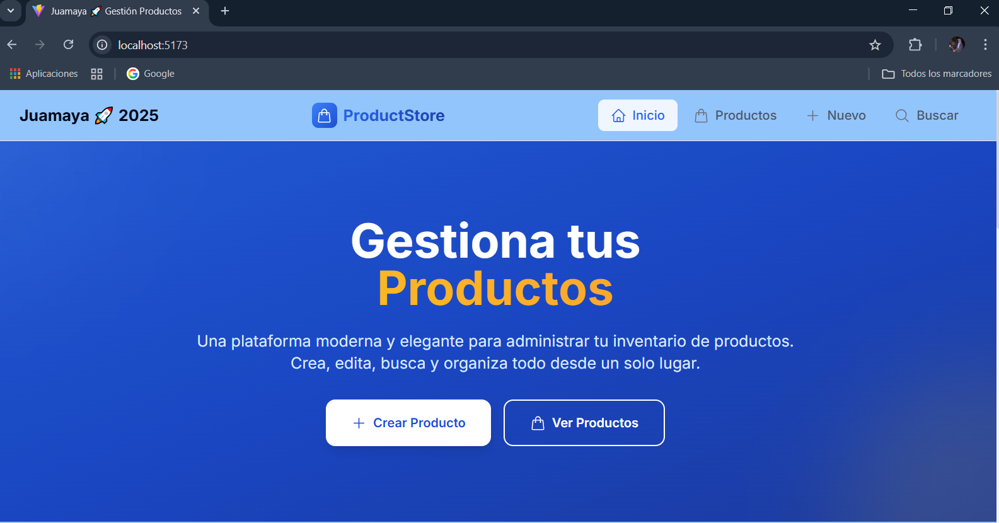
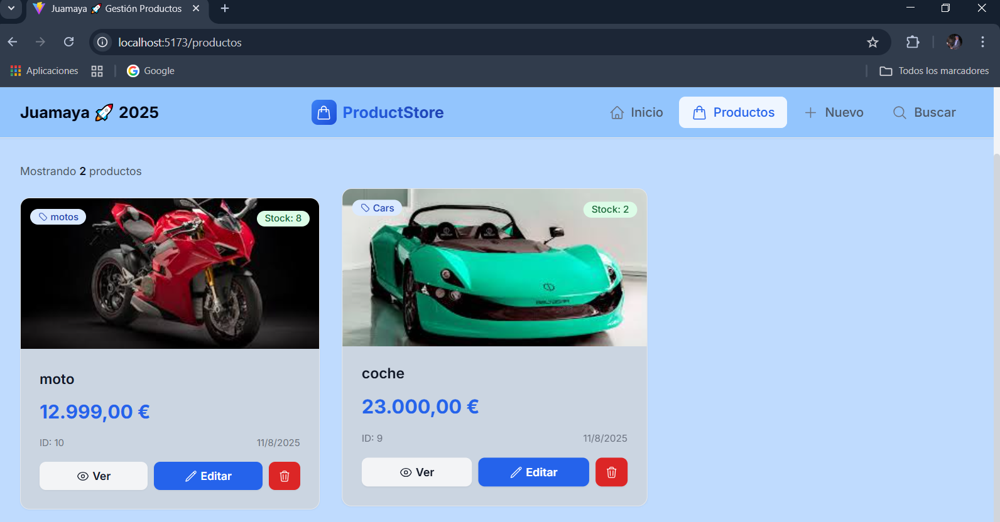

# API de Productos - Node.js + Express + PostgreSQL

Una API RESTful para gestión de productos construida con Node.js, Express y PostgreSQL.

## 🚀 Características

- ✅ Operaciones CRUD completas (Crear, Leer, Actualizar, Eliminar)
- ✅ Filtros y búsquedas avanzadas
- ✅ Paginación y ordenamiento
- ✅ Validación de datos
- ✅ Manejo de errores robusto
- ✅ Soft deletes (eliminación lógica)
- ✅ CORS habilitado
- ✅ Estructura de proyecto escalable

## 🛠️ Tecnologías

- **Node.js** - Runtime de JavaScript
- **Express.js** - Framework web
- **PostgreSQL** - Base de datos relacional
- **pg** - Cliente de PostgreSQL para Node.js
- **dotenv** - Gestión de variables de entorno
- **cors** - Middleware de CORS

## 📋 Prerequisitos

- Node.js (versión 14 o superior)
- PostgreSQL (versión 12 o superior)
- npm o yarn

## 🔧 Instalación

1. **Clonar o descargar el proyecto**
   ```bash
   cd API-NODEJS-POSTGRES
   ```

2. **Instalar dependencias**
   ```bash
   npm install
   ```

3. **Configurar variables de entorno**
   
   Edita el archivo `.env` con tus datos:
   ```env
   # Configuración del servidor
   PORT=3000

   # Configuración de la base de datos PostgreSQL
   DB_HOST=localhost
   DB_PORT=5432
   DB_USER=tu_usuario
   DB_PASSWORD=tu_password
   DB_NAME=productos_db

   # JWT Secret (para futuras funcionalidades)
   JWT_SECRET=tu_jwt_secret_key_muy_segura

   # Configuración del entorno
   NODE_ENV=development
   ```

4. **Configurar la base de datos**
   
   Conecta a PostgreSQL y ejecuta:
   ```sql
   CREATE DATABASE productos_db;
   ```
   
   Luego ejecuta el script de inicialización:
   ```bash
   psql -U tu_usuario -d productos_db -f src/database/init.sql
   ```

5. **Ejecutar la aplicación**
   ```bash
   # Modo desarrollo (con nodemon)
   npm run dev
   
   # Modo producción
   npm start
   ```

## 📚 Endpoints de la API

### Base URL
```
http://localhost:3000
```

### Productos

#### Obtener todos los productos
```http
GET /api/productos
```

**Parámetros de consulta opcionales:**
- `categoria` - Filtrar por categoría
- `nombre` - Filtrar por nombre (búsqueda parcial)
- `precio_min` - Precio mínimo
- `precio_max` - Precio máximo

**Ejemplo:**
```http
GET /api/productos?categoria=Electronics&precio_min=100&precio_max=500
```

#### Obtener producto por ID
```http
GET /api/productos/:id
```

#### Crear nuevo producto
```http
POST /api/productos
Content-Type: application/json

{
  "nombre": "Laptop Gaming",
  "descripcion": "Laptop para gaming de alta gama",
  "precio": 1299.99,
  "categoria": "Electrónicos",
  "stock": 5,
  "imagen_url": "https://example.com/laptop.jpg"
}
```

#### Actualizar producto
```http
PUT /api/productos/:id
Content-Type: application/json

{
  "nombre": "Laptop Gaming Pro",
  "precio": 1399.99,
  "stock": 3
}
```

#### Eliminar producto
```http
DELETE /api/productos/:id
```

#### Obtener categorías disponibles
```http
GET /api/productos/categorias
```

#### Buscar productos
```http
GET /api/productos/buscar/:termino
```

### Otros endpoints

#### Health Check
```http
GET /health
```

#### Información de la API
```http
GET /
```

## 📝 Ejemplos de respuesta

### Respuesta exitosa
```json
{
  "success": true,
  "data": {
    "id": 1,
    "nombre": "Laptop Gaming",
    "descripcion": "Laptop para gaming de alta gama",
    "precio": "1299.99",
    "categoria": "Electrónicos",
    "stock": 5,
    "imagen_url": "https://example.com/laptop.jpg",
    "activo": true,
    "fecha_creacion": "2024-01-15T10:30:00.000Z",
    "fecha_actualizacion": "2024-01-15T10:30:00.000Z"
  },
  "message": "Producto obtenido exitosamente"
}
```

### Respuesta de error
```json
{
  "success": false,
  "message": "Producto no encontrado",
  "data": null
}
```

### Lista de productos
```json
{
  "success": true,
  "data": [
    {
      "id": 1,
      "nombre": "Laptop Gaming",
      "precio": "1299.99",
      "categoria": "Electrónicos",
      "stock": 5
    }
  ],
  "count": 1,
  "message": "Productos obtenidos exitosamente"
}
```

## 🗃️ Esquema de Base de Datos

### Tabla: productos

| Campo | Tipo | Descripción |
|-------|------|-------------|
| id | SERIAL PRIMARY KEY | ID único del producto |
| nombre | VARCHAR(255) NOT NULL | Nombre del producto |
| descripcion | TEXT | Descripción detallada |
| precio | DECIMAL(10,2) NOT NULL | Precio del producto |
| categoria | VARCHAR(100) | Categoría del producto |
| stock | INTEGER DEFAULT 0 | Cantidad en inventario |
| imagen_url | VARCHAR(500) | URL de la imagen |
| activo | BOOLEAN DEFAULT true | Estado del producto |
| fecha_creacion | TIMESTAMP | Fecha de creación |
| fecha_actualizacion | TIMESTAMP | Fecha de última actualización |

## 🧪 Pruebas con cURL

```bash
# Obtener todos los productos
curl -X GET http://localhost:3000/api/productos

# Obtener producto por ID
curl -X GET http://localhost:3000/api/productos/1

# Crear nuevo producto
curl -X POST http://localhost:3000/api/productos \
  -H "Content-Type: application/json" \
  -d '{
    "nombre": "Mouse Gaming",
    "descripcion": "Mouse óptico para gaming",
    "precio": 79.99,
    "categoria": "Electrónicos",
    "stock": 15
  }'

# Actualizar producto
curl -X PUT http://localhost:3000/api/productos/1 \
  -H "Content-Type: application/json" \
  -d '{
    "precio": 89.99,
    "stock": 12
  }'

# Eliminar producto
curl -X DELETE http://localhost:3000/api/productos/1

# Buscar productos
curl -X GET http://localhost:3000/api/productos/buscar/laptop
```

## 📁 Estructura del Proyecto

```
API-NODEJS-POSTGRES/
├── src/
│   ├── config/
│   │   └── database.js          # Configuración de PostgreSQL
│   ├── controllers/
│   │   └── productoController.js # Lógica de controladores
│   ├── models/
│   │   └── Producto.js          # Modelo de datos
│   ├── routes/
│   │   └── productos.js         # Definición de rutas
│   ├── middleware/
│   │   └── errorHandler.js      # Manejo de errores
│   ├── database/
│   │   └── init.sql            # Script de inicialización
│   ├── app.js                  # Configuración de Express
│   └── server.js               # Punto de entrada
├── .env                        # Variables de entorno
├── package.json               # Dependencias del proyecto
└── README.md                  # Documentación
```

## 🚀 Despliegue

Para producción, considera:

1. **Variables de entorno de producción**
2. **Configuración de HTTPS**
3. **Rate limiting**
4. **Logging robusto**
5. **Monitoreo**
6. **Backup de base de datos**

## 🤝 Contribución

1. Fork el proyecto
2. Crea una rama para tu feature (`git checkout -b feature/AmazingFeature`)
3. Commit tus cambios (`git commit -m 'Add some AmazingFeature'`)
4. Push a la rama (`git push origin feature/AmazingFeature`)
5. Abre un Pull Request

## 📄 Licencia

Este proyecto está bajo la Licencia ISC.

## ❓ Soporte

Si tienes alguna pregunta o problema, por favor abre un issue en el repositorio.

---

**¡Disfruta construyendo con esta API de productos! 🎉**

---

# 🎨 Frontend Moderno Incluido

¡Ahora también incluye un **frontend completo** construido con React, Vite y TailwindCSS!

## 🚀 Características del Frontend

- ✨ **Interfaz moderna y elegante** - Diseño profesional con TailwindCSS
- 🎭 **Animaciones fluidas** - Transiciones suaves con Framer Motion
- 📱 **Totalmente responsive** - Optimizado para móviles, tablets y desktop
- 🔍 **Búsqueda avanzada** - Filtros dinámicos y búsqueda en tiempo real
- 📦 **CRUD completo** - Crear, ver, editar y eliminar productos
- 🎯 **UX intuitiva** - Navegación fácil y experiencia optimizada
- ⚡ **Alto rendimiento** - Construido con Vite para velocidad máxima

## 📁 Estructura Completa del Proyecto

```
API-NODEJS-POSTGRES/
├── 🔧 Backend (API)
│   ├── src/
│   │   ├── config/           # Configuración de base de datos
│   │   ├── controllers/      # Lógica de controladores
│   │   ├── models/          # Modelos de datos
│   │   ├── routes/          # Rutas de la API
│   │   ├── middleware/      # Middleware personalizado
│   │   └── database/        # Scripts SQL
│   ├── .env                # Variables de entorno del backend
│   └── package.json        # Dependencias del backend
│
├── 🎨 Frontend (React)
│   ├── src/
│   │   ├── components/      # Componentes reutilizables
│   │   ├── context/        # Context API (Estado global)
│   │   ├── pages/          # Páginas de la aplicación
│   │   ├── services/       # Servicios de API
│   │   └── ...
│   ├── public/             # Archivos públicos
│   ├── tailwind.config.js  # Configuración de TailwindCSS
│   ├── vite.config.js      # Configuración de Vite
│   └── package.json        # Dependencias del frontend
│
└── README.md              # Este archivo
```

## 🚀 Instalación Rápida (Stack Completo)

### 1. Backend (API)
```bash
# Instalar dependencias del backend
npm install

# Configurar variables de entorno
# Editar .env con tus credenciales de PostgreSQL

# Ejecutar script SQL para crear la base de datos
psql -U tu_usuario -d productos_db -f src/database/init.sql

# Iniciar el servidor API
npm run dev  # Ejecuta en http://localhost:3000
```

### 2. Frontend (React)
```bash
# Cambiar al directorio del frontend
cd frontend-productos

# Instalar dependencias del frontend
npm install

# Iniciar el servidor de desarrollo
npm run dev  # Ejecuta en http://localhost:5173
```

## 🌐 URLs de Acceso

- **API Backend**: http://localhost:3000
- **Frontend React**: http://localhost:5173
- **Documentación API**: http://localhost:3000/ (endpoints disponibles)
- **Health Check**: http://localhost:3000/health

## 📱 Funcionalidades del Frontend

### 🏠 **Página Principal**
- Hero section atractivo con gradientes
- Dashboard con estadísticas en tiempo real
- Vista previa de productos recientes
- Navegación rápida a todas las secciones

### 📦 **Gestión de Productos** 
- Lista de productos con cards elegantes
- Filtros avanzados (categoría, precio, nombre)
- Crear nuevos productos con formulario completo
- Editar productos existentes
- Ver detalles completos de cada producto
- Eliminar productos con confirmación

### 🔍 **Búsqueda Inteligente**
- Búsqueda por nombre, descripción o categoría
- Resultados instantáneos
- Sugerencias de búsqueda
- Filtros aplicables a resultados

### 🎨 **Diseño y UX**
- Tema de colores consistente
- Animaciones suaves en hover y transiciones
- Loading states elegantes
- Notificaciones toast para acciones
- Responsive design para todos los dispositivos

## 🛠️ Stack Tecnológico Completo

### Backend
- **Node.js** - Runtime de JavaScript
- **Express.js** - Framework web minimalista
- **PostgreSQL** - Base de datos relacional
- **pg** - Driver de PostgreSQL
- **dotenv** - Gestión de variables de entorno
- **cors** - Middleware para CORS

### Frontend  
- **React 18** - Librería de interfaces de usuario
- **Vite** - Build tool ultra-rápido
- **TailwindCSS** - Framework CSS utilitario
- **Framer Motion** - Librería de animaciones
- **React Router** - Enrutamiento SPA
- **Axios** - Cliente HTTP
- **React Hot Toast** - Notificaciones
- **Heroicons** - Iconos SVG

## 📸 Capturas de Pantalla

*(Aquí puedes agregar capturas de pantalla de la aplicación funcionando)*







## 🚀 Despliegue en Producción

### Backend
- Configurar variables de entorno de producción
- Usar PM2 o similar para gestión de procesos
- Configurar nginx como reverse proxy
- SSL/HTTPS con Let's Encrypt

### Frontend
- Build optimizado: `npm run build`
- Despliegue en Vercel, Netlify o similar
- CDN para assets estáticos
- Variables de entorno de producción

## 🤝 Contribuir al Proyecto

1. Fork el repositorio
2. Crea una rama para tu feature: `git checkout -b feature/nueva-funcionalidad`
3. Realiza tus cambios en backend y/o frontend
4. Commit tus cambios: `git commit -m 'Agregar nueva funcionalidad'`
5. Push a la rama: `git push origin feature/nueva-funcionalidad`
6. Abre un Pull Request

## 📝 Scripts Útiles

### Backend
```bash
npm start        # Modo producción
npm run dev      # Modo desarrollo con nodemon
```

### Frontend
```bash
npm run dev      # Servidor de desarrollo
npm run build    # Build para producción
npm run preview  # Vista previa de build
npm run lint     # Linter de código
```

## 🆘 Solución de Problemas

### Backend no inicia
- Verificar que PostgreSQL esté ejecutándose
- Revisar credenciales en `.env`
- Confirmar que la base de datos `productos_db` existe

### Frontend no conecta con API
- Confirmar que el backend esté ejecutándose en puerto 3000
- Verificar configuración de proxy en `vite.config.js`
- Revisar configuración de CORS en el backend

### Problemas de CORS
- El backend ya incluye configuración CORS
- Verificar que el frontend esté ejecutándose en puerto 5173

---

## 🎉 ¡Aplicación Completa Lista!

¡Ahora tienes una aplicación full-stack moderna y profesional para gestión de productos!

**Backend**: API RESTful robusta con Node.js + Express + PostgreSQL  
**Frontend**: SPA moderna con React + Vite + TailwindCSS

**¡Empieza a desarrollar y personaliza según tus necesidades! 🚀**
